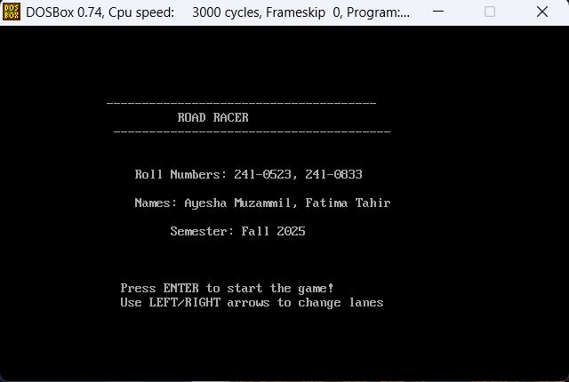
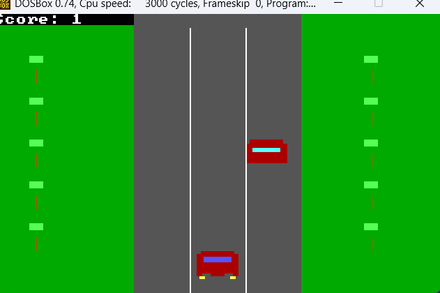
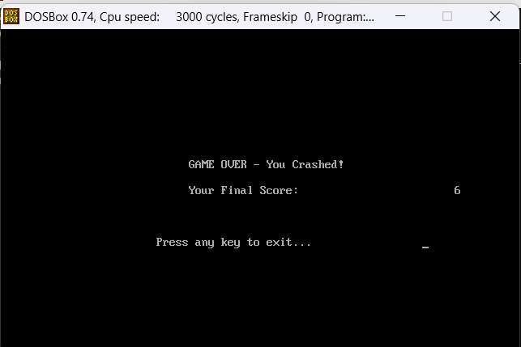

# 🚗 COAL Car Racing Game (Assembly Language)

A classic car racing game developed in **8086 Assembly Language** as part of the Computer Organization and Assembly Language (COAL) course.

The game uses BIOS interrupts, VGA graphics (Mode 13h), and custom keyboard and timer interrupt handlers to create a smooth real-time gaming experience.

---

## ✨ Features

- 🚗 Player-controlled racing car
- 🛣️ Animated road with lane markings
- 🌳 Landscape and roadside trees
- ⌨️ Keyboard-controlled movement
- ⏱️ Timer-driven animation
- 📊 Live score display
- 💥 Game Over screen
- 🚪 Exit confirmation menu
- 🎨 VGA graphics (320×200, 256 colors)

---

## 🛠 Technologies

- 8086 Assembly Language
- BIOS Interrupts
- VGA Mode 13h Graphics
- DOS Environment

---

## 📂 Project Structure

```text
pq1.asm          # Complete game source code
images/          # Project screenshots
README.md
LICENSE
.gitignore
```

---
## 📸 Screenshots

### Game Start



### Gameplay



### Game Over




---

## ▶️ How to Run

1. Open the project in your preferred 8086 Assembly development environment.
2. Assemble the source code.
3. Run the generated executable in a DOS-compatible environment (such as DOSBox if required).

---

## 📄 License

This project is licensed under the MIT License.
